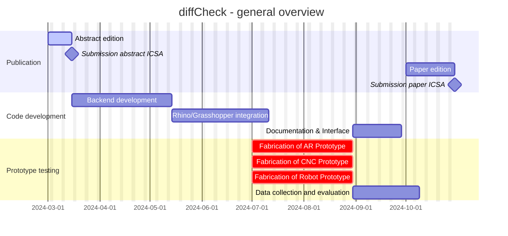
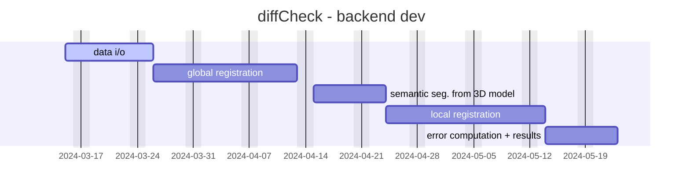

# diffCheck
<p align="left">
    
</p>

Temporary repository for diffCheck

## Roadmap





## 3rd party libraries

The project uses the following 3rd party libraries:
- `Open3d 0.18.0` for 3D point cloud processing it needs to be installed from source [from here](https://github.com/isl-org/Open3D/releases/download/v0.18.0/open3d-devel-windows-amd64-0.18.0.zip), unzip the file to `Program Files/Open3D`:
```terminal
Expand-Archive -DestinationPath 'C:\Users\localuser\Downloads' -LiteralPath "C:\Users\localuser\Downloads\open3d-devel-windows-amd64-0.18.0.zip"
Move-Item -LiteralPath 'C:\Users\localuser\Downloads\open3d-devel-windows-amd64-0.18.0\*' -Destination 'C:\Program Files\Open3D\'
rmdir 'C:\Users\localuser\Downloads\open3d-devel-windows-amd64-0.18.0\'
```
- `Eigen` for linear algebra (needed by `Open3d`)
- `CGAL` for general geometric processing and IO
- `Boost` for general utilities, it needs to be installed from source [from the repo](https://github.com/boostorg/boost) as such:
```terminal
git clone --recursive https://github.com/boostorg/boost.git
cd boost
cmake -G "Visual Studio 16 2019" -A x64 -DCMAKE_INSTALL_PREFIX="C:\Program Files\Boost" -S . -B build
cmake --build build --config Release --target ALL_BUILD
cmake --build build --config Release --target INSTALL
```

## How to build c++ project
To build and test the project, follow the following steps:

```terminal
cmake/config.bat
cmake/build.bat
./build/bin/diffCheckApp.exe <-- for prototyping
```

## Prototype diffCheck in C++
To prototype:
1) add a header/source file in `src/diffCheck` and include the header in `diffCheck.hh` interface
1) test it in `diffCheckApp` (the cmake will output an executable in bin)

See the [CONTRIBUTING.md](https://github.com/diffCheckOrg/diffCheck/blob/main/CONTRIBUTING.md) for more information on how to prototype with diffCheck (code guidelines, visualizer, utilities, etc).


## TODO:
- [ ] @Andrea: add writing functions for mesh and point cloud
- [ ] @Andrea: refactor `IOManager.hh` with a class `IOManager` and static methods
- [ ] @Andrea: test Rhino exporeted `.ply` files
- [ ] @Andrea: tests suite for IO /pcdmesh / visualizer
