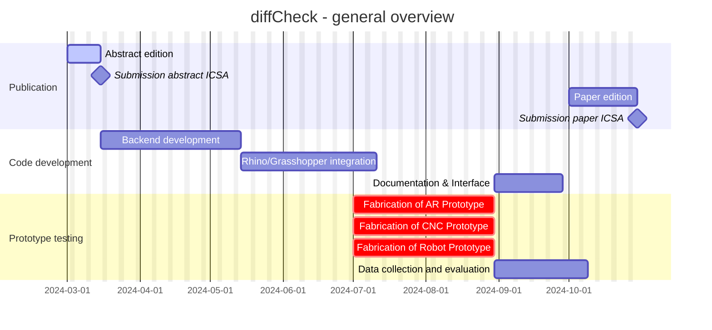
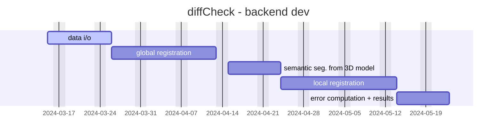

# diffCheck
Temporary repository for diffCheck

## Roadmap

```mermaid
gantt
    dateFormat  YYYY-MM-DD
    title       diffCheck - general overview
    excludes    weekends

    section Publication
    Abstract edition                    :active, absed, 2024-03-01, 2024-03-15
    Submission abstract ICSA            :milestone, icsaabs, 2024-03-15, 0d
    Paper edition                       :paperd, 2024-10-01, 2024-10-30
    Submission paper ICSA               :milestone, icsapap, 2024-10-30, 0d

    section Code development
    Backend development                 :backenddev, after icsaabs, 6w
    Rhino/Grasshopper integration       :rhghinteg, after backenddev, 6w
    Documentation & Interface           :docuint, after fabar, 3w

    section Prototype testing
    Fabrication of AR Prototype         :crit, fabar, 2024-07-01, 2024-08-30
    Fabrication of CNC Prototype        :crit, fabcnc, 2024-07-01, 2024-08-30
    Fabrication of Robot Prototype      :crit, fabrob, 2024-07-01, 2024-08-30
    Data collection and evaluation      :dataeval, after fabrob, 4w
```

```mermaid
gantt
    dateFormat  YYYY-MM-DD
    title       diffCheck - backend dev
    excludes    weekends

    data i/o                                 :active, dataio, 2024-03-15, 1w
    global registration                      :glbreg, after dataio, 2w
    semantic seg. from 3D model              :semseg, after glbreg, 1w
    local registration                       :locreg, after semseg, 2w
    error computation + results              :errcomp, after locreg, 1w
```
