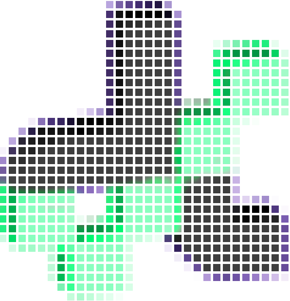
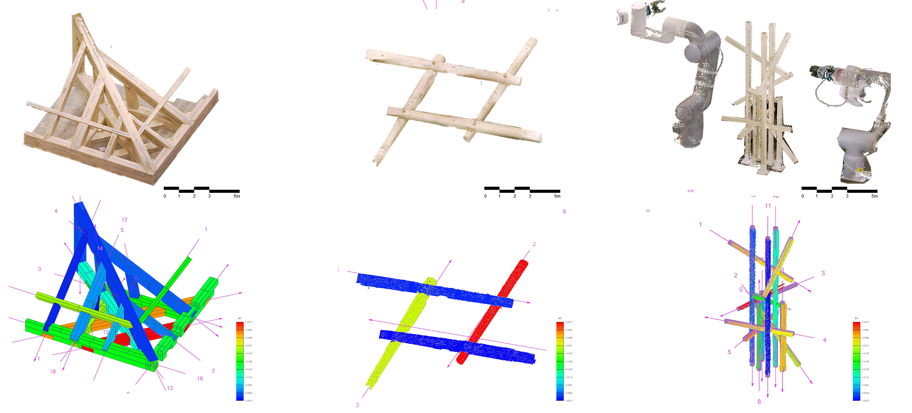
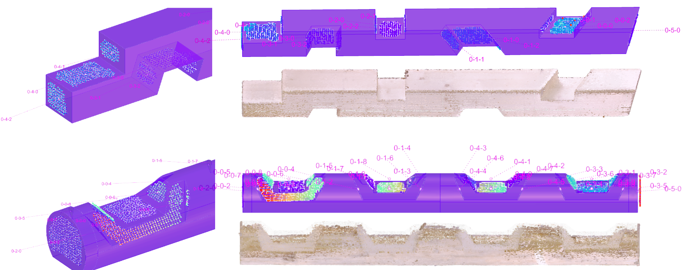
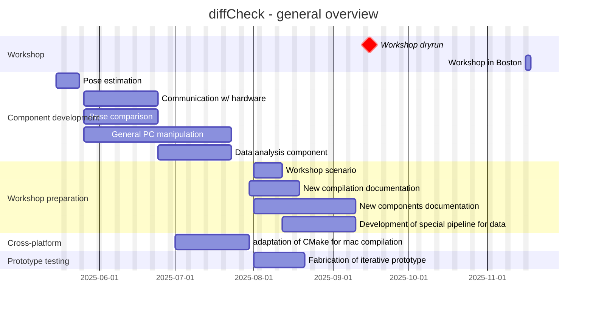

<p align="center">
    
</p>
<p align="center">
    
    
    
    
    
    
    
    
    <a href="https://doi.org/10.5281/zenodo.13843959"></a>
</p>


# DiffCheck: CAD-Scan comparison

With `diffCheck`, you can easily compare your scans and 3D models of timber structures or joinery to measure precision and see the differences at a glance, [here](https://diffcheckorg.github.io/diffCheck/quickstart.html)!

`diffCheck` can also function as a general purpose  point cloud processing toolset and we hope that the digital community will use it, see the interest, and contribute to this open-source project we starting!

`diffCheck` is originally developed and now maintained by Andrea Settimi (PhD), Damien Gilliard (PhD) from the [Laboratory of Timber Construction (IBOIS, lab head: Prof. Yves Weinand)](https://www.epfl.ch/labs/ibois/), Eleni Skevaki (PhD) and Dr. Marirena Kladeftira (Post-Doc) from the [Laboratory for Creative Computation (CRCL, lab head: Prof. Stefana Parascho)](https://www.epfl.ch/labs/crcl/) here at [Ecole Polytechnique Fédérale de Lausanne (EPFL)](https://www.epfl.ch/en/).

`diffCheck` is designed to be user-friendly and can be used either via a Grasshopper plug-in, we provide tutorials and online documentation for each component and its Python API.

## Quickstart

The main interface is a Grasshopper plug-in, it's distributed via the yak package manager so just type the `_PackageManager` in Rhino and type 

```
diffCheck
```

Open your Grasshopper canvas and search for the `DF` components!

## Functionalities

`diffCheck` is a toolset that allows you to compare a 3D model of a structure to evaluate its assembly or joint's quality and accuracy.

<div align="center">
    
    <p>Example of several structures assembled with different digital technologies.</p>
</div>
<div align="center">
    
    <p>Example of joinery evaluation.</p>
</div>


## Documentation

The full documentation, with tutorials, automatic documentation for GHComponents and PythonAPI is available [here](https://diffcheckorg.github.io/diffCheck/).


## Roadmap



## How to contribute

If you want to contribute to the project, please refer to the [contribution guidelines]([./CONTRIBUTING.md](https://diffcheckorg.github.io/diffCheck/contribute.html)).
