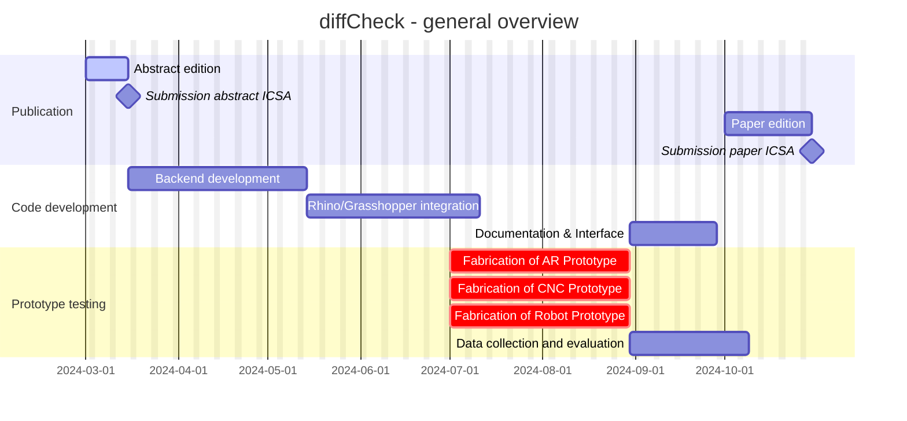

    

    
    
    
    
    
    
    
    

# DiffCheck: CAD-Scan comparison

diffCheck(DF) allows to identify discrepancies across point clouds and 3D models of both individually machined timber pieces featuring various joints as well as fully assembled timber structures. It can help you quantify the differences between the CAD and scanned fabricated structure, providing a comprehensive report that highlights the discrepancies.

The software is designed to be user-friendly and can be used either via a Grasshopper plug-in or its Python API.

Visit the [DiffCheck website](https://diffcheckorg.github.io/diffCheck/) for more information and documentation.

The software is developed by the [Laboratory of Timber Construction (IBOIS)](https://www.epfl.ch/labs/ibois/) and the [Laboratory for Creative Computation (CRCL)](https://www.epfl.ch/labs/crcl/) at [Polytechnique Fédérale de Lausanne (EPFL)](https://www.epfl.ch/en/).

## Roadmap

