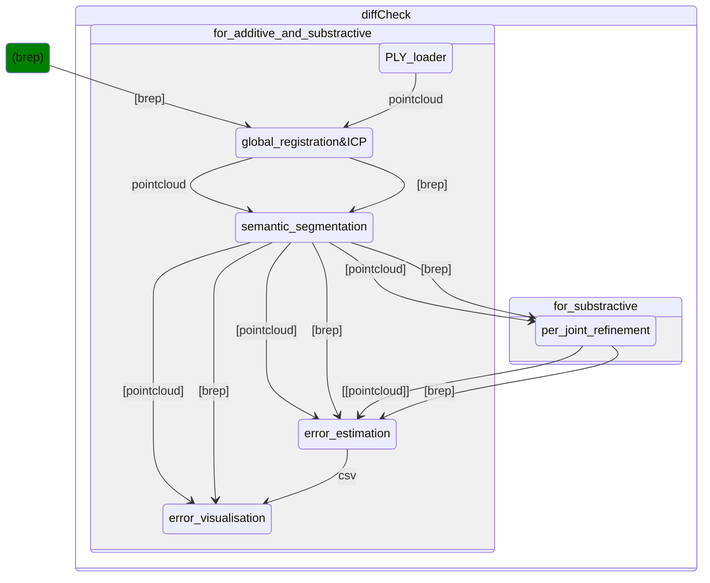

<p align="center">
    
</p>
<p align="center">
    
    
    
    
    
</p>


## Roadmap


## 3rd party libraries

The project uses the following 3rd party libraries:
- `Open3d 0.18.0` for 3D point cloud processing as pre-build binaries ([store here](https://github.com/diffCheckOrg/submodule-open3d.git))
- `Eigen` for linear algebra
- `CGAL` for general geometric processing and IO
- `Boost` for general utilities as pre-build binaries ([store here](https://github.com/diffCheckOrg/submodule-boost.git))

## How to build c++ project
To build and test the project, follow the following steps:

```terminal
cmake/config.bat
cmake/build.bat
./build/bin/Release/diffCheckApp.exe <-- for prototyping
```

## Prototype diffCheck in C++
To prototype:
1) add a header/source file in `src/diffCheck` and include the header in `diffCheck.hh` interface
1) test it in `diffCheckApp` (the cmake will output an executable in bin)

See the [CONTRIBUTING.md](https://github.com/diffCheckOrg/diffCheck/blob/main/CONTRIBUTING.md) for more information on how to prototype with diffCheck (code guidelines, visualizer, utilities, etc).

## Component roadmap
From the 3/5/2024 meeting, the architecture of the different grasshopper components was discussed as following:
[] PLY loader : loads the ply files and converts them in RhinoCommon objects
[] Global registration & refined registration to align the scan to the reference model
[] Semantic segmentation to identify the pieces or joints in the point cloud
[] Per-joint refinement to refine the global registration to each joints (only in the "substractive" case)
[] Error estimation to evaluate the error for each piece or joint
[] Error visualisation to visualise the error, only converts the data from error estimation, no calculation.
The brep element in the graph is only here to visualize the fact that we need the breps as data, but it is not a diffCheck component.



Note : `[]` = list
