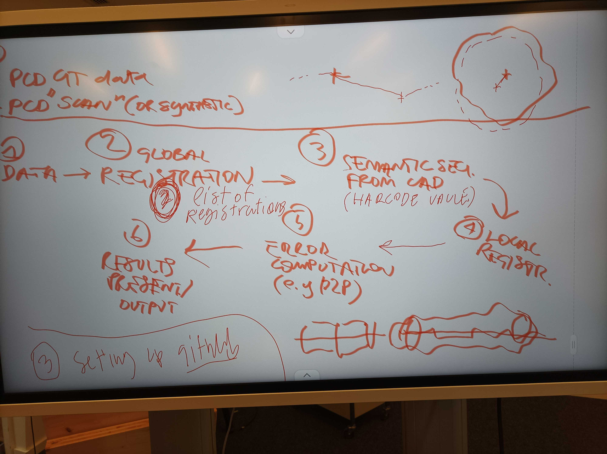
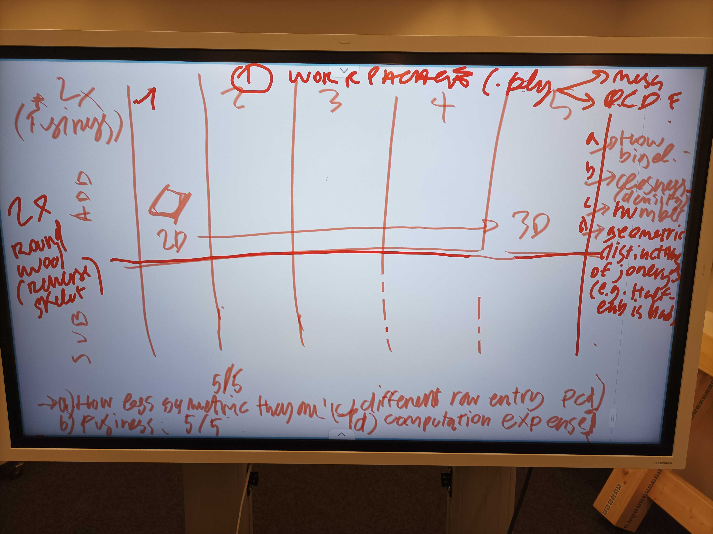

# Dev log for DiffCheck
The log is used to keep track of the changes made to the project and to provide a history of the project's development.

## 2024-03-15 kick off meeting (@Eleni, @Andrea, @Damien)

Goal backend: develop local and global registrations and segmentation of the joints based on the 3D model and the index of faces that are part of a joint + test suite with different quality of point clouds, and evaluate quality of different registration techniques.

@Eleni proposes to put as an option to use the registration or no. This can be usefull in the case of robotic application. By knowing the 3d coordinates of the origin of the scan, diffCheck can be also employed to get some evaluation on the correct positioning of the piece in respect to the robot. (*We can start opening feature requests in the issue tracker)

Image of the workflow:

### Roadmap

Here's the mid-milestones we set for the first phase of development working package:

1) DATA I/O (1-2 Weeks)

    Ground Truth (populated 3D model) 5 steps from simple to complex based on: (for pieces and joints)
   	 How big,
   	 density (how similar the elements are),
   	 number,
   	 geometric distinctiveness
    Test scan (synthetic PC)

2) Registration (2 Weeks): Find a good registration for full model registration and test it on data.

3) Semantic seg. from 3D model (1 Week)
    
4) Local registration (2 Weeks)

5) Error computation (1 Week)

6) Present results (1 Week)

### TODO:

    --> @Eleni: Have the 3D models + joints (some preliminary in 1 week’s time)
    --> @Damien Make SOTA, main registration methods (finished by next week)
    --> @Andrea Setup GitHub (finished by next week)