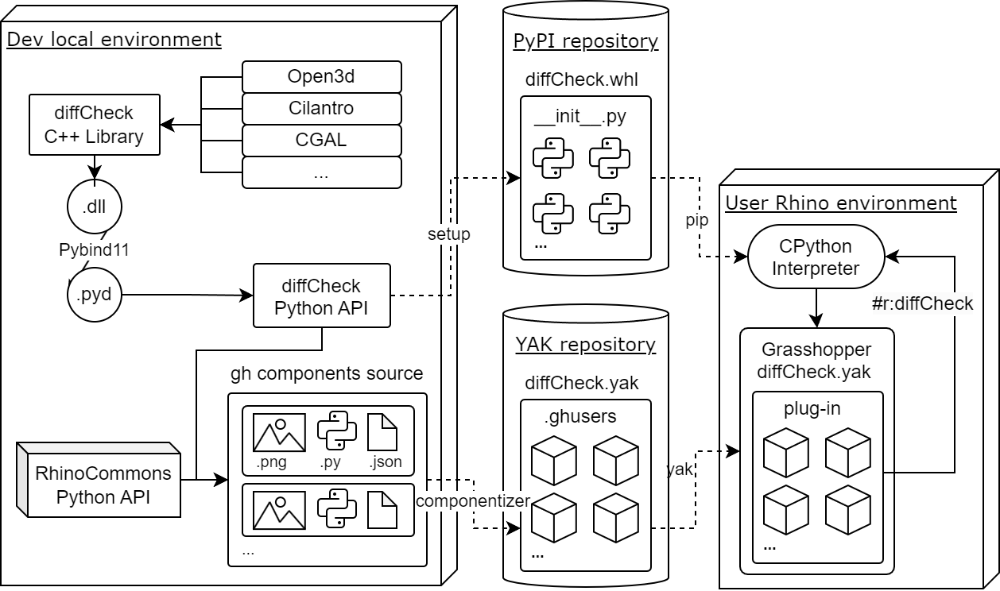

(df_architecture_guide)=
# diffCheck architecture

The software architecture of DF is organized into three main sections. 
* a) **C++**: 
  The first foundational portion of the source code is represented by a C++ umbrella library regrouping low-level dependencies such as *Open3d*, *CGAL* and *Cilantro* which power the back-end of the most complex and demanding computational functionalities DF can offer. 
* b) **PythonAPI**: 
  The previous portion  portion is wrapped into the second DF's component: an API written in Python 3.9.1 and distributed via PyPI (Python Package Index).
* c) **GHPlugin**:
  Finally, the GH Python-based plug-in represents only the top-level visual scripting DF's interface.

Here is a diagram of the software architecture:

 

    

 

With Rhino v.8’s integration of CPython into its .NET ecosystem, we developed a fully Python-based Grasshopper plug-in. Distributed through Rhino’s Yak manager, it requires no extra installations. Inspired by the Compas framework, the plug-in is composed entirely of .ghuser objects, supporting CI practices with automatic component documentation. Additionally, we believe a Python-based plug-in encourages broader contributions, as Python’s simplicity and widespread use make it more accessible to the digital fabrication community.