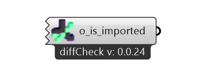

(installation)=
# Installing diffCheck

Using `diffCheck` requires *Rhino* and *Grasshopper*. The plug-in can be installed simply by:

*  Open *Rhino* and tpe on the command bar: 
    ``` 
    _PackageManager
    ```
* search for `diffCheck` and click on install.
* launch *Grasshopper* you will find the a new tab in the toolbar.
* drop on the canvas the [test component](gh_DFTester) and connect it to a point cloud and a CAD model.

<p align="center">
    
</p>


```{important}
For now, diffCheck is only supported on Windows ❖.