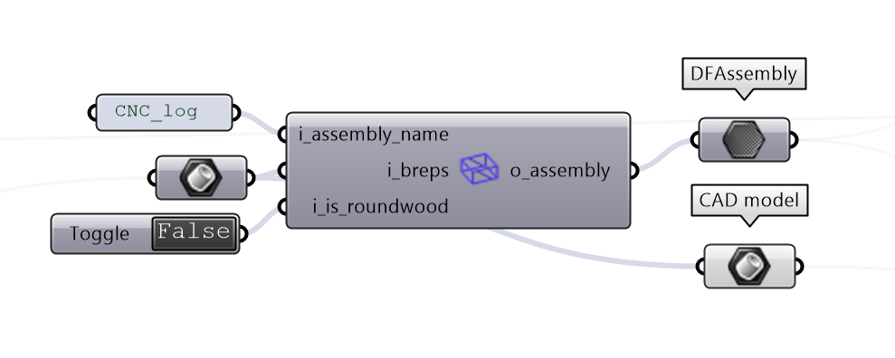
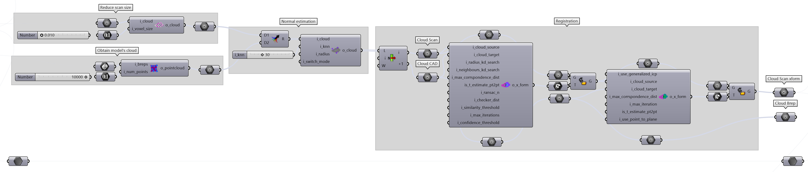

(jointeval)=
# Joints evaluation

## Objective

The following tutorial will guide you through the evaluation of joints in timber construction with DF. As a studycase we fabricated 3 beams presenting the same joints with:

- a chainsaw, by hand
- a circular saw, by hand
- a CNC Maka machine

the goal being to evaluate the quality of the joints and the accuracy of the fabrication processes.

## Example files

    

You can download the full tutorial here:
- :download:`the Rhino file <_static/example_files/subtractive_rh_v1.3dm>`
- :download:`the Grasshopper file <_static/example_files/subtractive_gh_v1.ghx>`

---

## Steps

### 1. Input the data

    

### 2. Build the DFAssembly

    

### 3. Registration of CAD and scan

    

### 4. Segmentation of the scan

    

### 6. Error computation

    

### 7. Error Visulization

    

### 8. Export the results

    

