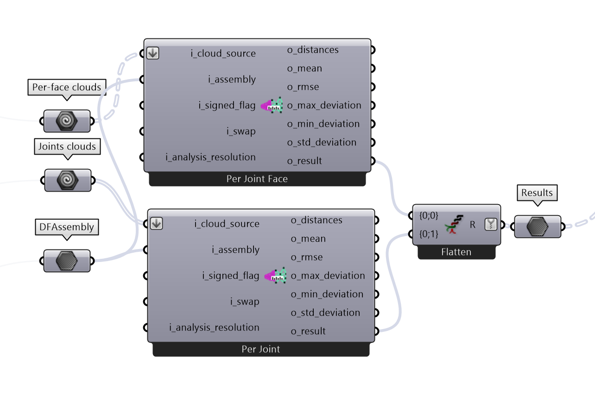
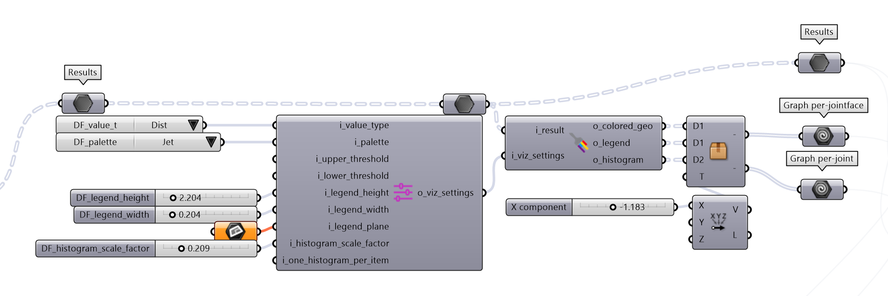
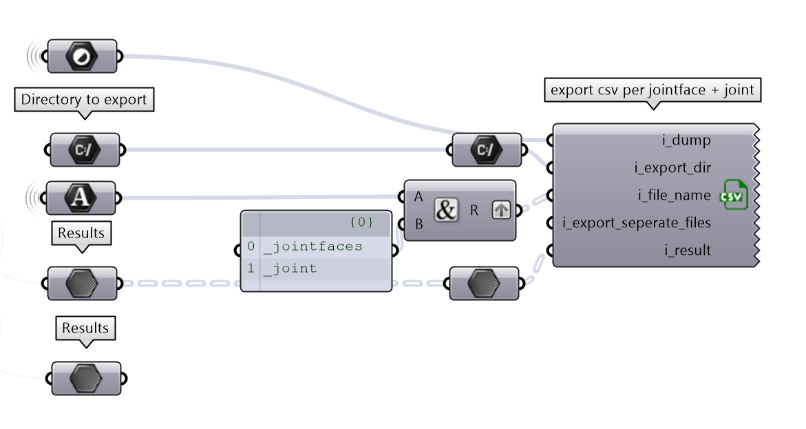

(jointeval)=
# Joints evaluation

## Objective

The following tutorial will guide you through the evaluation of joints in timber construction with DF. As a studycase we fabricated 3 beams presenting the same joints with:

- a chainsaw, by hand
- a circular saw, by hand
- a CNC Maka machine

the goal being to evaluate the quality of the joints and the accuracy of the fabrication processes.

## Example files

    

You can download the full tutorial here:
- :download:`the Rhino file <_static/example_files/subtractive_rh_v1.3dm>`
- :download:`the Grasshopper file <_static/example_files/subtractive_gh_v1.ghx>`

---

## Steps

### 1. Input the data
First things first, let's import your cleaned scan and corresponding polysurface model in Rhino.

    

### 2. Build the DFAssembly
Here we convert the model of our structure into the internal datatype of diffcheck, DFAssembly. This component detects the joints and their faces.

    

### 3. Registration of CAD and scan
The registration is the process of aligning the CAD model with the scan. This is done by selecting corresponding points on the CAD model and the scan and find a transformation that minimizes the distance between them.

    

### 4. Segmentation of the scan
Once the scan and the CAD model are aligned, we can segment the scan to isolate the parts of the raw point cloud of the scan that corresponds tothe joints.

    

### 6. Error computation
At this point we can compute the error between the CAD model and the scan. The error is computed as the distance between the closest point on the CAD model and the scan. The current DF's output metrics are:

* *distance* : the distance between the closest point on the CAD model and the scan
* *mean* : the mean distance between the closest point on the CAD model and the scan
* *max_deviation* : the maximum distance between the closest point on the CAD model and the scan
* *min_deviation* : the minimum distance between the closest point on the CAD model and the scan
* *std_deviation* : the standard deviation of the distance between the closest point on the CAD model and the scan

    

### 7. Error Visulization
DF allows you to quickly visualize the errors in the Rhino viewport. The color of the points represents the distance between the CAD model and the scan. The color scale can be adjusted to better visualize the error. We also provide a graph that shows the distribution of the errors.

    

### 8. Export the results
The results can be also exported in a CSV file for further analysis or documentation.

    

