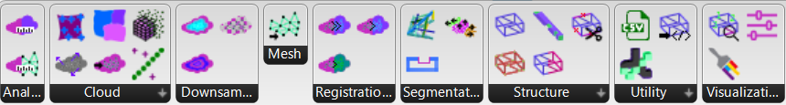

(key-concepts)=
# Key-concepts


## A modular structure

To make DF broadly applicable and allow users to customize their evaluation pipelines, we designed the plugin with a modular structure. By assembling and combining different components, users can tailor their workflows to fit specific project needs.

<p align="center">
    
</p>

By combining different components, users can create a wide range of evaluation pipelines. The plugin includes components for:

- **Data preparation**: Import and preprocess data from different sources.
- **Data analysis**: Compute metrics and visualize results.
- **Data manipulation**: Arrange and cluster scans or convert one datatype (e.g. brep) to another (e.g. cloud).
- **Data export**: Export results to different formats.

Have a look at [our documentation for all the components](gh_components).


## Evaluation pipelines

In DF, evaluation pipelines to compare CAD and scans are *sequences of components that process data from input to output. They can be as simple as a single component or as complex as a chain of multiple components.* Normally it is composed of the following steps:

```{mermaid}
flowchart LR
    A{Data input} --> 
    B(Data cleaning) --> 
    C(Registration) -->
    D(Error Computation) -->
    E{Data export}
    D --> F[Visualization]
```

To show how this works in DF, we provide two examples of evaluation pipelines we have done for timber construction by combining different components:

- [Evaluation of joins in timber construction](joints-evaluation)
- [Evaluation of assembled structures in timber construction](assembly-evaluation)

> You can create your own evaluation pipelines by combining different components and let us know if you want to share them with the community or you need a specific component that is not available yet, send an email to [diffcheckorg@gmail.com](mailto:diffcheckorg@gmail.com)!