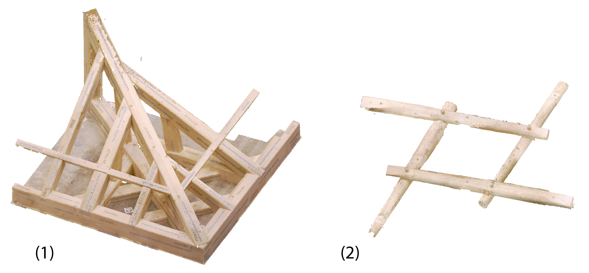
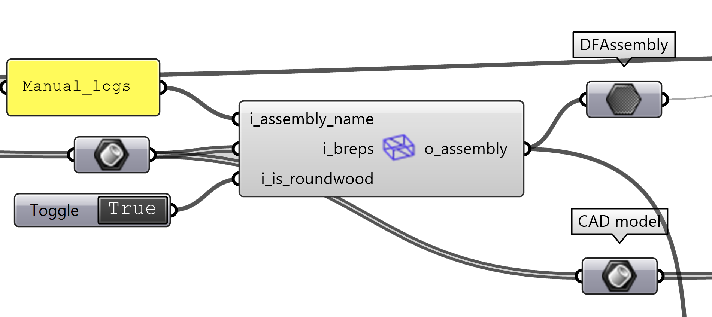
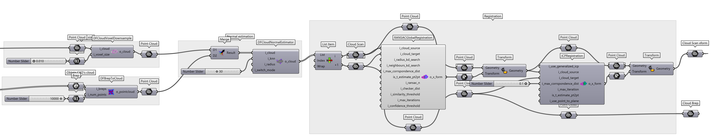
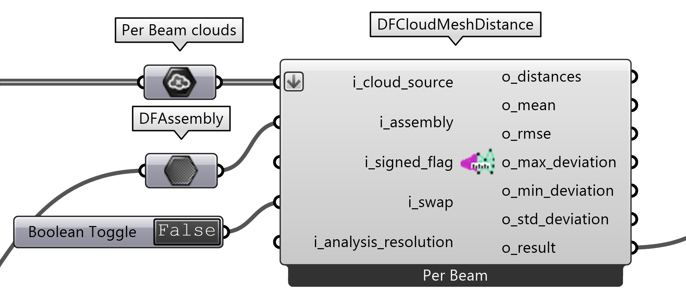
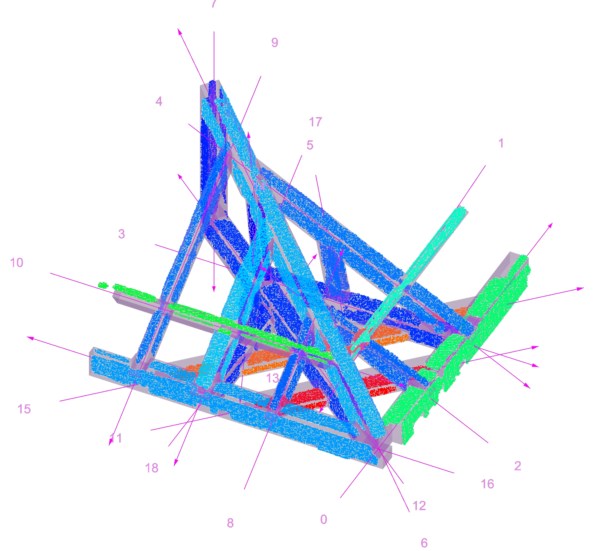
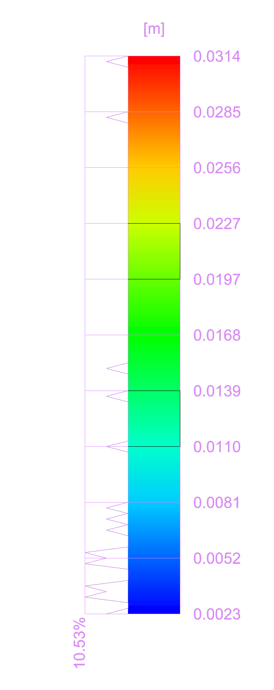
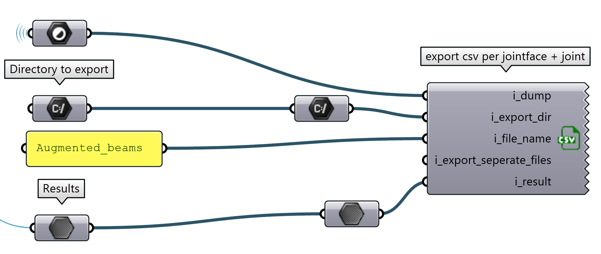

# Manual Assembly

As study cases for the manual assembly, we fabricated:
1. a roof structure detail connected with half-lap scarf joints and half-lap cross joints that were manually fabricated with Augmented Reality (AR) assistance and assembled with the aid of standard construction tools and equipment.
2. a frame structure with four wood logs connected with half-lap cross joints

<br>

<p align="center">
    
</p>


```{eval-rst}
.. raw:: html

    <div style="display: flex; gap: 200px; justify-content: center;">

        <a href="./_static/example_files/additive_gh_roof_v1.gh" download style="display: inline-block; padding: 10px 20px; font-size: 16px; color: white; background-color: #28a745; text-align: center; text-decoration: none; border-radius: 5px;">
            <svg xmlns="http://www.w3.org/2000/svg" width="20" height="20" fill="currentColor" class="bi bi-arrow-down-circle" viewBox="0 0 16 16">
                <path fill-rule="evenodd" d="M1 8a7 7 0 1 0 14 0A7 7 0 0 0 1 8m15 0A8 8 0 1 1 0 8a8 8 0 0 1 16 0M8.5 4.5a.5.5 0 0 0-1 0v5.793L5.354 8.146a.5.5 0 1 0-.708.708l3 3a.5.5 0 0 0 .708 0l3-3a.5.5 0 0 0-.708-.708L8.5 10.293z"/>
            </svg>
            Download .gh file for (1)
        </a>

        <a href="./_static/example_files/additive_gh_logs_v1.gh" download style="display: inline-block; padding: 10px 20px; font-size: 16px; color: white; background-color: #28a745; text-align: center; text-decoration: none; border-radius: 5px;">
            <svg xmlns="http://www.w3.org/2000/svg" width="20" height="20" fill="currentColor" class="bi bi-arrow-down-circle" viewBox="0 0 16 16">
                <path fill-rule="evenodd" d="M1 8a7 7 0 1 0 14 0A7 7 0 0 0 1 8m15 0A8 8 0 1 1 0 8a8 8 0 0 1 16 0M8.5 4.5a.5.5 0 0 0-1 0v5.793L5.354 8.146a.5.5 0 1 0-.708.708l3 3a.5.5 0 0 0 .708 0l3-3a.5.5 0 0 0-.708-.708L8.5 10.293z"/>
            </svg>
            Download .gh file for (2)
        </a>

    </div>
```
---

## Steps

### 1. Input the data
First things first, let's import your cleaned scan and corresponding polysurface model in Rhino.

<p align="center">
    
</p>

### 2. Build the DFAssembly
Here we convert the model of our structure into the internal datatype of diffcheck, DFAssembly.

<p align="center">
    
</p>

```{hint}
If you are evaluating round sections e.g. logs, you can set the `i_is_roundwood` input to `True` in the `DFBuildAssembly` component.

<p align="center">
    
</p>

```

> DF's components:
> * [`DFAssebmly`](gh_DFBuildAssembly)

### 3. Registration of CAD and scan
The registration is the process of aligning the CAD model with the scan. This is done by selecting corresponding points on the CAD model and the scan and find a transformation that minimizes the distance between them.

<p align="center">
    
</p>

> DF's components:
> * [`DFBrepToCloud`](gh_DFBrepToCloud)
> * [`DFCloudVoxelDownsample`](gh_DFCloudVoxelDownsample)
> * [`DFCloudNormalEstimator`](gh_DFCloudNormalEstimator)
> * [`DFRANSACGlobalRegistration`](gh_DFRANSACGlobalRegistration)
> * [`DFICPRegistration`](gh_DFICPRegistration)

### 4. Segmentation of the scan
Once the scan and the CAD model are aligned, we can segment the scan to isolate the parts of the raw point cloud of the scan that corresponds tothe joints.

<p align="center">
    
</p>

> DF's components:
> * [`DFCloudNormalSegmentator`](gh_DFCloudNormalSegmentator)
> * [`DFCADSegmentator`](gh_DFCADSegmentator)
> * [`DFColorizeCloud`](gh_DFColorizeCloud)

### 5. Error computation
At this point we can compute the error between the CAD model and the scan. The error is computed as the distance between the closest point on the CAD model and the scan. The current DF's output metrics are:

* *distance* : the distance between the closest point on the CAD model and the scan
* *mean* : the mean distance between the closest point on the CAD model and the scan
* *max_deviation* : the maximum distance between the closest point on the CAD model and the scan
* *min_deviation* : the minimum distance between the closest point on the CAD model and the scan
* *std_deviation* : the standard deviation of the distance between the closest point on the CAD model and the scan

<p align="center">
    
</p>

> DF's components:
> * [`DFCloudMeshDistance`](gh_DFCloudMeshDistance)

### 6. Error Visualization
DF allows you to quickly visualize the errors in the Rhino viewport. The color of the points represents the distance between the CAD model and the scan. The color scale can be adjusted to better visualize the error. We also provide a graph that shows the distribution of the errors.

<p align="center">
    
</p>

<div style="display: flex; justify-content: space-around; align-items: center;">
    <figure style="margin: 10px;">
        
        <figcaption>View on the visualization of the analysed clouds on the CAD model itself. </figcaption>
    </figure>
    <figure style="margin: 10px;">
        
        <figcaption>View of the graph of the corresponding distribution of the total error directly in Rhino.</figcaption>
    </figure>
</div>

> DF's components:
> * [`DFVisualizationSettings`](gh_DFVisualizationSettings)
> * [`DFVisualization`](gh_DFVisualization)

### 7. Export the results
The results can be also exported in a CSV file for further analysis or documentation.

<p align="center">
    
</p>

The CSV contains the values per element for the Roof Case Study (1)..


| Beam ID | Min Deviation | Max Deviation | Std Deviation | RMSE  | Mean  |
|---------|---------------|---------------|---------------|-------|-------|
| 0       | 0.0001        | 0.0899        | 0.0103        | 0.0171| 0.0137|
| 1       | 0             | 0.0263        | 0.0075        | 0.0134| 0.0112|
| 2       | 0             | 0.0176        | 0.0044        | 0.0068| 0.0052|
| 3       | 0             | 0.0258        | 0.0030        | 0.0048| 0.0037|
| 4       | 0             | 0.0192        | 0.0092        | 0.0072| 0.0057|
| 5       | 0             | 0.0711        | 0.0046        | 0.0061| 0.0053|
| ...     | ...           | ...           | ...           | ...   | ...   |

and for the Frame Case Study (2)..


| Beam ID | Min Deviation | Max Deviation | Std Deviation | RMSE  | Mean  |
|---------|---------------|---------------|---------------|-------|-------|
| 0       | 0             | 0.1066        | 0.0147        | 0.0202| 0.0139|
| 1       | 0             | 0.1448        | 0.0158        | 0.0214| 0.0144|
| 2       | 0             | 0.1155        | 0.024         | 0.0402| 0.0323|
| 3       | 0             | 0.103         | 0.0198        | 0.0333| 0.0267|


> DF's components:
> * [`DFCsvExporter`](gh_DFCsvExporter)