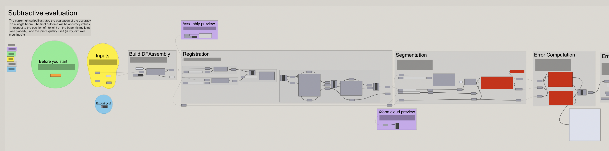

# Experiment on Mac
1. Install diffCheck library (replace <user_name> with your user name)
```
/Users/<user_name>/.rhinocode/py39-rh8/python3.9 -m pip install diffcheck-1.3.0-py3-none-any.whl --force-reinstal
```

2. Open the `subtractive_gh_v1_mac_portability.gh` file, the expected result would be:


There should be no error before the Segmentation.